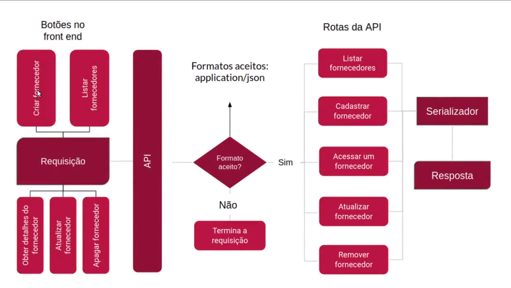

# REST API do Gatito Petshop

### Não esqueça de mudar a senha do container MySQL e alterar as configurações de conexão com o BD. Como estou apenas usando o repositório para estudo, decidi também versionar o arquivo de configurações e arquivo do docker-compose.

---

## Fazendo esse curso eu aprendi:

- Criar uma aplicação do zero seguindo a convenção REST
- Arquitetar APIs escaláveis
- Entendi como requisições HTTP funcionam
- Conheci os componentes de uma requisição como cabeçalhos e status
- Como melhorar a comunicação entre aplicações

---

## Ações do Frontend

